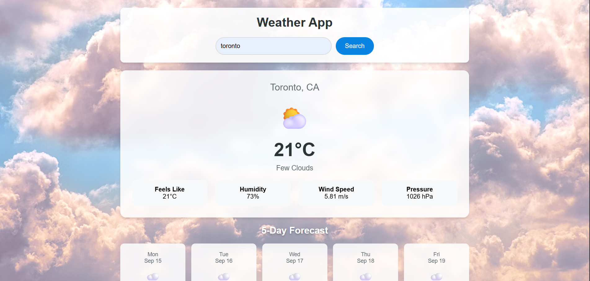

# 🌤️ Forecastly – Weather App  

A responsive **Weather Application** built using **HTML, CSS, and JavaScript**.  
The app fetches real-time weather data from the **OpenWeatherMap API** and displays **current weather conditions** along with a **5-day forecast**.  

---

## ✨ Features  

### 🔹 Search & Display  
- Search weather by city name  
- Shows location, temperature, description, and weather icon  
- Displays **feels like**, humidity, wind speed, and pressure  

### 🔹 Dynamic Design  
- Weather-based background images (sunny, cloudy, rain, snow, etc.)  
- Emoji-style weather icons  
- Smooth show/hide transitions for weather data  

### 🔹 Forecast System  
- 5-Day forecast with date, icon, and temperature  
- Organized grid layout for better readability  

### 🔹 Error & Loading Handling  
- Loader while fetching data  
- Error messages for invalid city names or API issues  

---

## 📱 Responsiveness  
- **Desktop (≥1024px)** → Centered card layout + forecast grid  
- **Tablet (768px–1023px)** → Adjusted text + compact forecast  
- **Mobile (≤480px)** → Stacked layout, easy input, forecast in a single column  

---

## 🛠️ Tech Stack  
- **HTML5**  
- **CSS3** (Flexbox, animations, responsive design)  
- **JavaScript (Vanilla JS)**  
- **OpenWeatherMap API**  

---

## 📂 Project Structure  
│── index.html # Main HTML file  
│── style.css # Styling and responsiveness  
│── script.js # JavaScript logic (API calls, DOM updates)  
│── README.md # Project documentation  
│── assets/ # Screenshots, icons, or images (optional)  

---

## 👀 Preview  
  

---

## 👩‍💻 Author  
Designed and Developed by **Krish**  

---

## ℹ️ About  
**Forecastly** was created as a modern, minimal, and responsive weather application.  
It’s a part of my front-end development projects, focusing on API integration and interactive UI design.  
